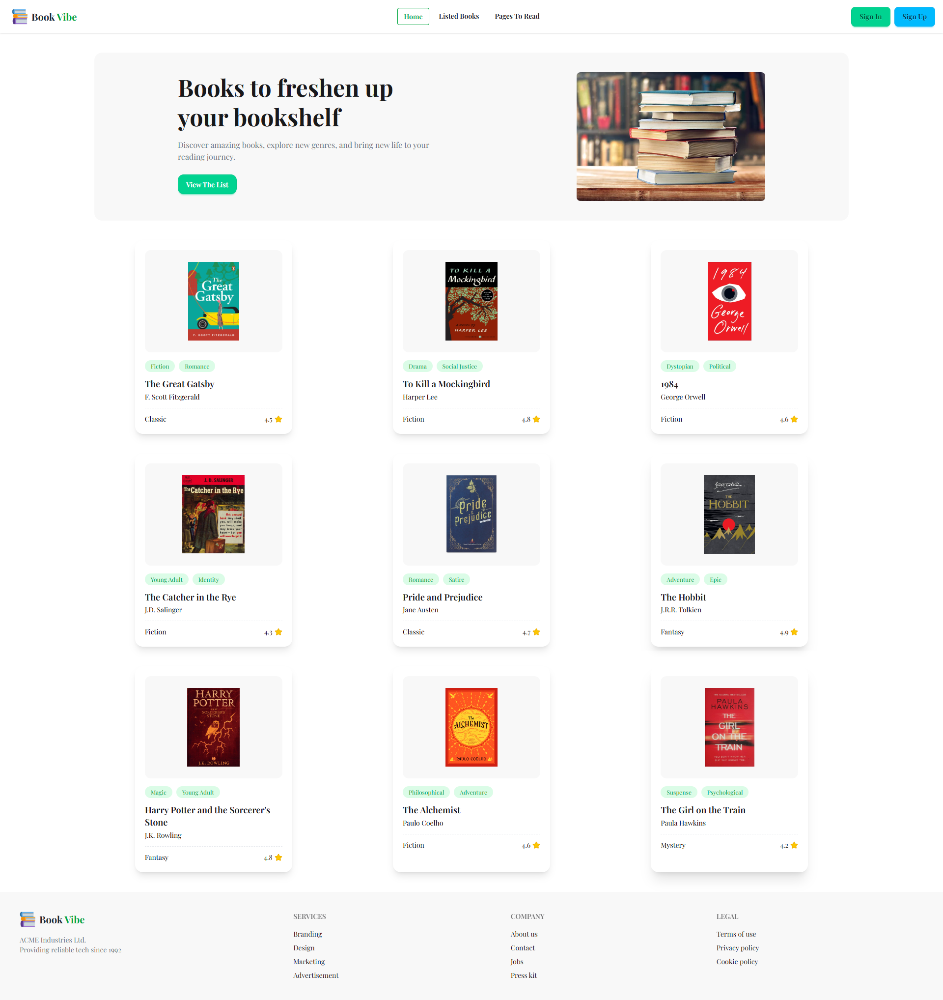
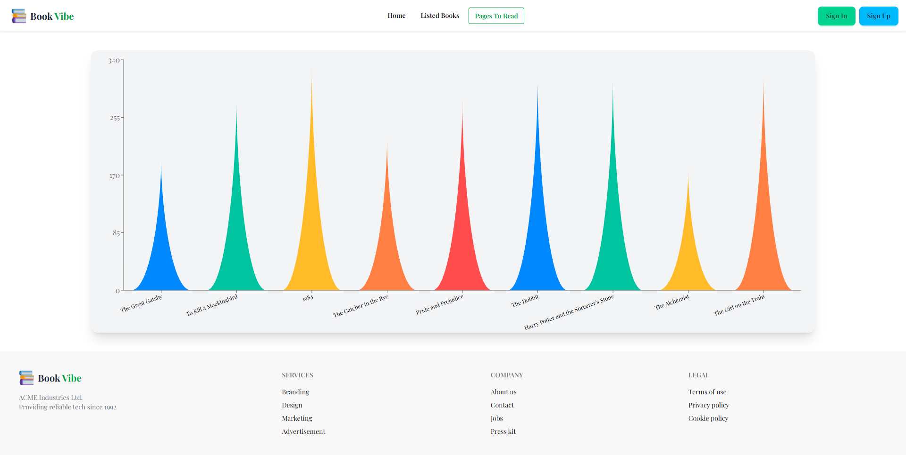
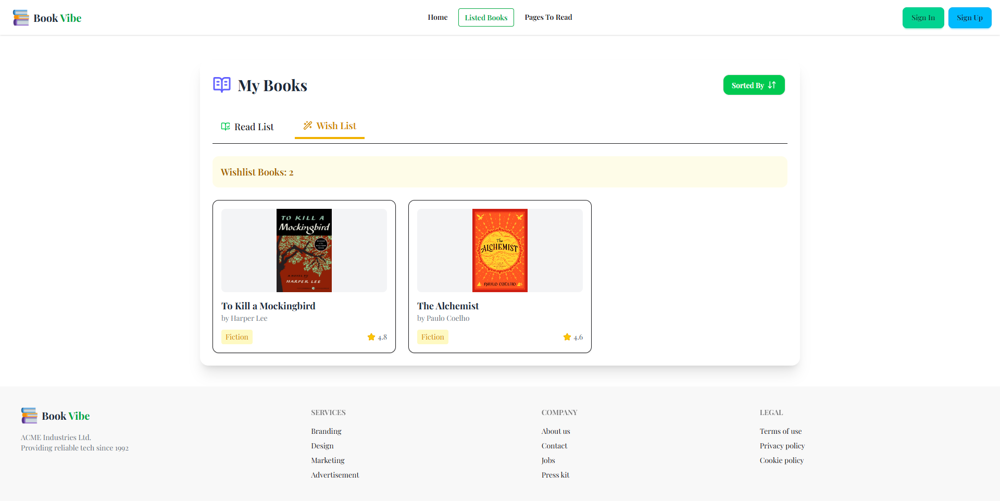
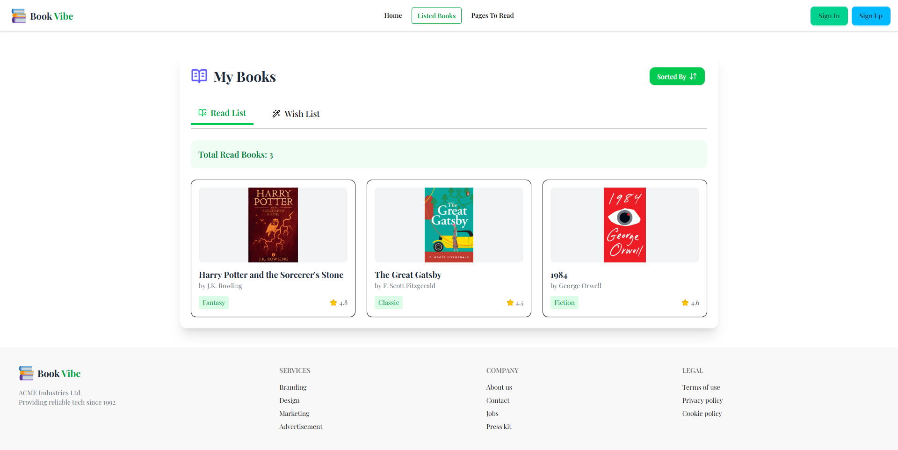

# 📚 Book Library Web App

A fully responsive **Book Library web application** built using React. This project allows users to browse books, add them to a wishlist, and mark books as already read. It includes tab-based navigation, dynamic UI updates, and JSON-based data fetching.

---

## 🚀 Live Demo

[Explore Book Library Live](https://melodious-taiyaki-d65ca2.netlify.app/page_to_read)

---

## 🎯 Project Overview

This project is a modern book management system built with React. It helps users organize books into Wishlist and Read categories while providing a clean and responsive UI.

It demonstrates core frontend concepts like **React Router, state management, component design, and API-style JSON fetching**.

---

## 📸 Screenshots

### Main Interface
<table width="100%">
  <tr>
    <td width="50%" align="center">
      <h3>🏠 Home Dashboard</h3>
      
    </td>
    <td width="50%" align="center">
      <h3>📊 Pages Read Analytics</h3>
      
    </td>
  </tr>
</table>

### Book Tracking Tabs
<table width="100%">
  <tr>
    <td width="50%" align="center">
      <h3>❤️ Wishlist Collection</h3>
      
    </td>
    <td width="50%" align="center">
      <h3>📘 Completed Reads</h3>
      
    </td>
  </tr>
</table>

---

## ✨ Features

- 📖 Display list of books dynamically
- ❤️ Add books to Wishlist
- 📘 Mark books as Read
- 🔀 Tab system for Wishlist & Read books
- 📱 Fully responsive design (mobile, tablet, desktop)
- ⚡ Fast navigation using React Router
- 🎨 Modern UI using Tailwind CSS & DaisyUI
- 📦 JSON-based data loading

---

## 🛠️ Tech Stack

- **Framework:** React.js  
- **Routing:** React Router DOM  
- **Styling:** Tailwind CSS & DaisyUI  
- **Language:** JavaScript (ES6+)  
- **Data:** Local JSON Data Source  

---

## 📦 Data Source & Fetching

Book data is structured and stored inside a local JSON configuration file. It mimics a REST API structure, dynamically handling asynchronous data fetching across multiple page views using React hooks.

---

## 📂 Project Structure

```text
book-library/
├── public/
├── src/
│   ├── components/
│   ├── pages/
│   ├── routes/
│   ├── main.jsx
│   └── index.css
├── UI/
│   ├── Home.png
│   ├── Graph.png
│   ├── Wish.png
│   └── Read.png
├── package.json
└── README.md
